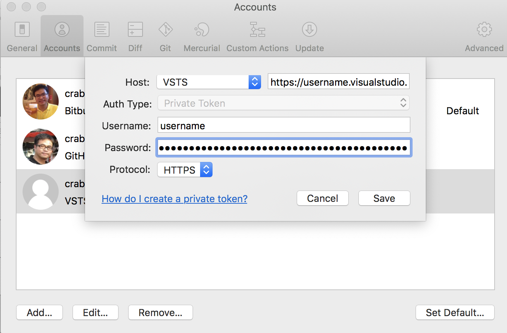

# Sourcetree for Azure DevOps

- [AzureDevOps] 登入至 Repository
- [AzureDevOps] 側滑選單 Repos > Files
- [AzureDevOps] Clone > Copy HTTPS path `https:{username}@dev.azure.com/`
- [Sourcetree] 開啟 Sourcetree Account
- [Sourcetree] 點擊 Add...，Host: 選擇 VSTS，路徑改為 `https:{username}.visualstudio.com/`
- [AzureDevOps] Clone > Generate Git Credentials
- [AzureDevOps] Copy Username / Password
- [Sourcetree] Paste Username / Passwrod
- [Sourcetree] Protocol 選擇 HTTPS

即可加入 Azure DevOps 的帳號至 Sourcetree

> 在 Azure DevOps 產生的密碼請留存，下載Repository時，會需再次驗證使用

Token 期限

> Private Token 最多限制為一年，到時間時需再次設定